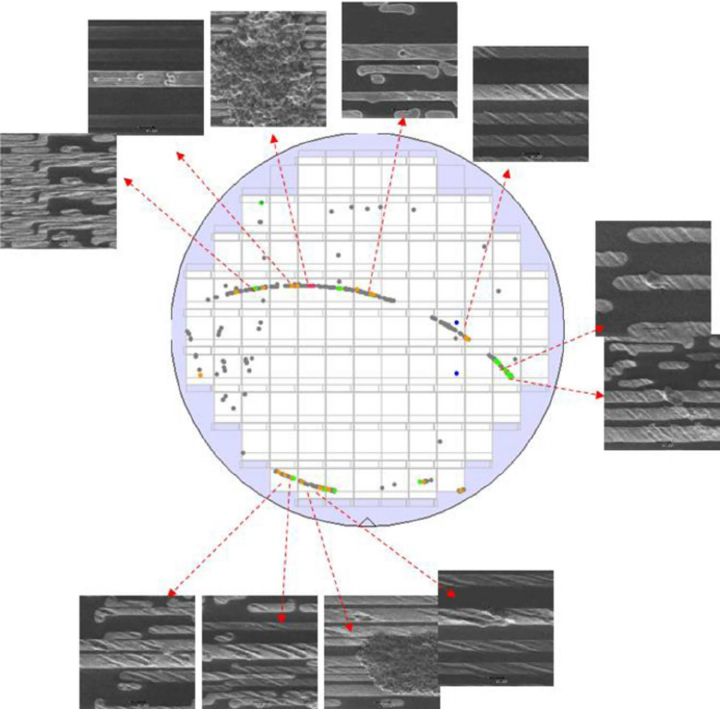
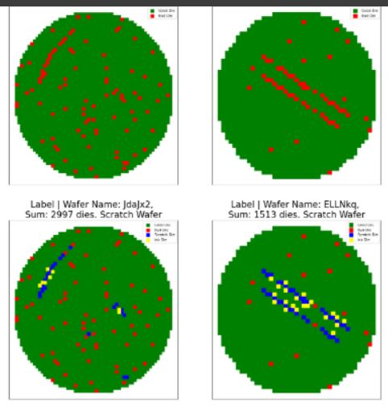
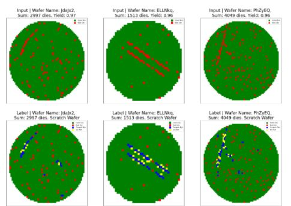

# Wafer-scratch-detection

This project is focused on identifying scratches in semiconductor wafers by analyzing wafer maps. The primary goal of this project was to develop a solution for detecting scratches in wafers, a critical step in semiconductor manufacturing, which involves identifying both faulty and good dies affected by scratches.
<p float="left">
  
  
  
</p> 

## Project Overview

Semiconductor wafers, used to fabricate microelectronic devices, can develop defects such as scratches during the manufacturing process. These scratches are often difficult to detect and can lead to quality issues with the final products. The challenge here was to build a model capable of identifying these scratches based on wafer maps.

In this project, I implemented a solution that uses machine learning to predict whether a given die (a single unit of the wafer) is part of a scratch, which could either be faulty or good. The data provided included the status of individual dies, and the goal was to build a predictive model capable of identifying "scratches" in future wafer maps.

## Data

The dataset consists of wafer maps from various operations, with each die marked as either good or bad. The dataset includes the following columns:

* **WaferName**: Name of the wafer.
* **DieX**: Horizontal position of the die on the wafer.
* **DieY**: Vertical position of the die on the wafer.
* **IsGoodDie**: A binary column indicating whether the die is good (1) or faulty (0).
* **IsScratchDie**: A binary column indicating whether the die belongs to a scratch (1) or not (0).

### Problem Statement

Given a wafer map with information about the dies (their position and status), the task was to develop a model that could predict whether each die belongs to a scratch, which could be marked either as "Scratch" (faulty die) or "Ink" (good die that should be removed due to its association with the scratch).

### Objective

The objective was to create a model that could:

* Detect individual dies that are part of a scratch.
* Classify them accurately based on their position and status.

Additionally, we considered the business goals, which included automating the detection process, improving wafer quality, and reducing the number of false positives (incorrectly marking a good die as part of a scratch).

## Approach

### Data Exploration & Preprocessing

The first step involved exploring the data to understand the structure of the wafer maps, the distribution of good and bad dies, and identifying any correlations between die positions and their classification as scratch or not. Preprocessing included handling any missing values and encoding categorical data.

### Feature Engineering

I used the positional data (DieX and DieY) as features, as these were key in detecting spatial patterns in the wafer map that might indicate a scratch. Additionally, I explored the relationship between neighboring dies, as scratches often form elongated clusters.

### Model Selection

For this problem, I experimented with various machine learning models, including:

* Logistic Regression
* Decision Trees
* Random Forests
* Gradient Boosting Machines (GBM)

I selected the best-performing model based on its accuracy in detecting both "scratch" and "ink" dies.

### Evaluation Metrics

To evaluate the performance of the model, I used the following metrics:

* **Accuracy**: The overall percentage of correct predictions.
* **Precision and Recall**: To ensure the model accurately identifies both scratch and ink dies, minimizing both false positives and false negatives.
* **F1-Score**: A balance between precision and recall.

### Model Training & Evaluation

After training the model, I tested it on a separate validation set and evaluated its performance using the metrics mentioned above. The goal was to strike a balance between high recall (detecting all scratches) and high precision (not marking good dies as scratches).

## Results
  

After experimenting with different models, I was able to achieve a robust model capable of identifying scratches in wafer maps with a reasonable balance between precision and recall.

### Key Insights

* **Spatial Patterns**: The position of dies on the wafer plays a significant role in identifying scratches. Scratches often appear in elongated patterns across the wafer.
* **Business Implications**: Automating this process saves time and reduces human errors, ultimately improving the quality of the manufacturing process.

## Conclusion

This project provided a comprehensive solution for detecting scratches in semiconductor wafer maps, using machine learning to automate a previously manual and error-prone task. By focusing on business goals such as automation and quality, this model can help reduce manufacturing costs and improve the overall yield of semiconductor devices.

## Installation & Usage

1. Clone this repository:

   ```bash
   git clone https://github.com/your-username/scratch-detection
   cd scratch-detection
   ```

2. Install the required dependencies:

   ```bash
   pip install -r requirements.txt
   ```

3. Run the model training script:

   ```bash
   python train_model.py
   ```

4. Once the model is trained, you can use it to make predictions on new wafer maps:

   ```bash
   python predict.py --input <path_to_input_data> --output <path_to_output_predictions>
   ```

## License

This project is licensed under the MIT License. See the [LICENSE](LICENSE) file for details.

---

Feel free to reach out if you have any questions or would like to contribute to this project!
